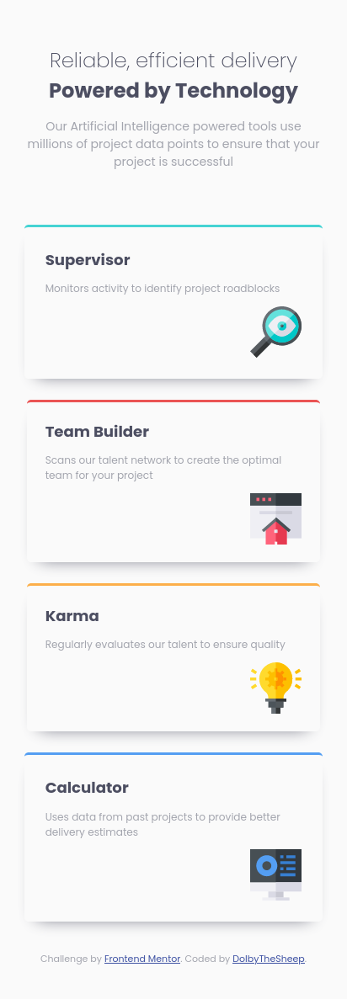

# Frontend Mentor - Four card feature section solution

This is a solution to the [Four card feature section challenge on Frontend Mentor](https://www.frontendmentor.io/challenges/four-card-feature-section-weK1eFYK). Frontend Mentor challenges help you improve your coding skills by building realistic projects. 

## Table of contents

- [Overview](#overview)
  - [The challenge](#the-challenge)
  - [Screenshot](#screenshot)
  - [Links](#links)
- [My process](#my-process)
  - [Built with](#built-with)
  - [What I learned](#what-i-learned)

## Overview

### The challenge

Users should be able to:

- View the optimal layout for the site depending on their device's screen size

### Screenshot

| Desktop                                       |                                Mobile       |
|-----------------------------------------------|---------------------------------------------|
|||

### Links

- Solution URL: [https://github.com/DolbyTheSheep/Four-Card-Feature.git](https://github.com/DolbyTheSheep/Four-Card-Feature.git)
- Live Site URL: [https://dolbythesheep.github.io/Four-Card-Feature/](https://dolbythesheep.github.io/Four-Card-Feature/)

## My process

### Built with

- Semantic HTML5 markup
- CSS custom properties
- Flexbox
- Mobile-first workflow

### What I learned

- How to make a shadow with `box-shadow: var(--very-dark-blue) 0px 10px 20px -15px`.